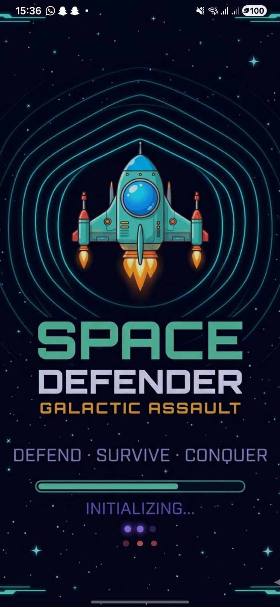
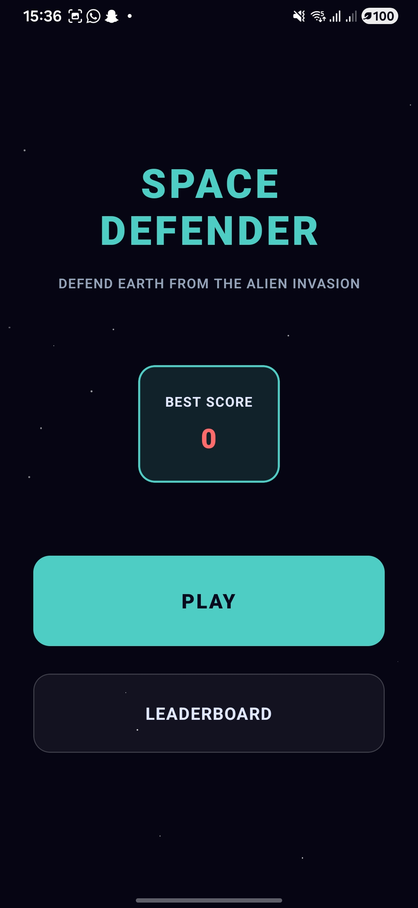
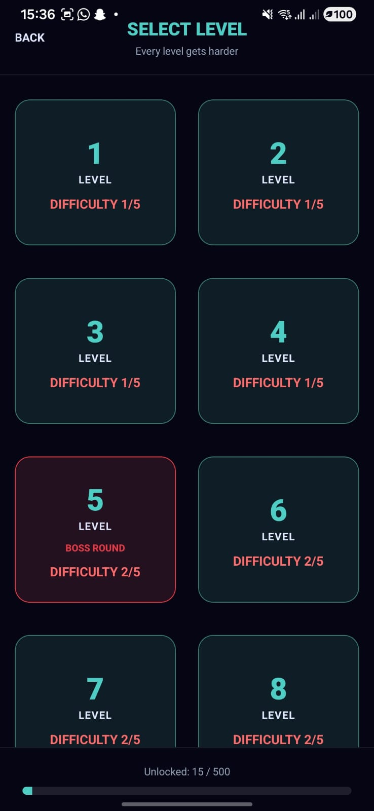
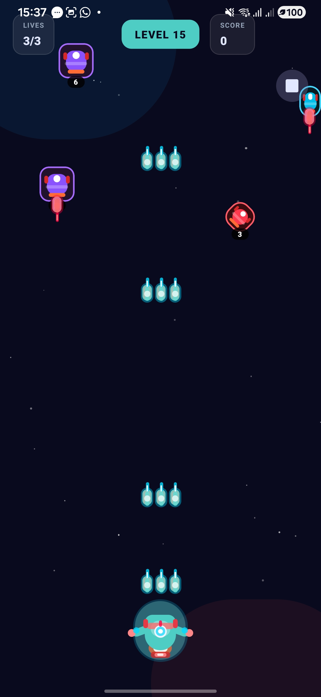

# 🚀 SpaceDefender - React Native Game

A fully-featured space shooter game built with React Native and React Native Game Engine. Defend Earth from waves of alien invaders in this classic arcade-style game!


## 📱 Screenshots

### Game Screens

| Main Menu | Gameplay | Level Progress | Game Over |
|-----------|----------|----------------|-----------|
|  |  |  |  |

*Experience the thrilling space shooter gameplay across different game states!*

## 🎮 Game Features

### Core Gameplay
- **Smooth Controls** - Touch-based movement with gesture handling
- **Auto-Firing** - Continuous bullet shooting with upgradeable weapons
- **Enemy Waves** - Progressive difficulty with multiple enemy types
- **Particle Effects** - Explosions and visual feedback
- **Sound Effects** - Immersive audio experience

### Enemy Types
- **🔷 Basic Enemies** - Standard red invaders
- **⚡ Fast Enemies** - Quick orange attackers
- **🛡️ Tank Enemies** - Heavy purple defenders with multiple HP
- **👑 Boss Enemies** - Epic bosses appearing every 5 levels

### Weapon System
- **Level 1-2**: Single shot
- **Level 3-4**: Double shot
- **Level 5+**: Triple shot with increased fire rate

### Game Systems
- **10 Progressive Levels** - Increasing difficulty and enemy speed
- **Score Tracking** - Points for each enemy destroyed
- **Lives System** - 3 lives with game over functionality
- **Pause/Resume** - Full game state management
- **Leaderboard** - High score tracking

## 🛠️ Technical Implementation

### Architecture
- **React Native Game Engine** - Entity-component-system architecture
- **TypeScript** - Full type safety
- **Gesture Handling** - React Native Gesture Handler
- **Navigation** - React Navigation with smooth transitions
- **State Management** - Custom hooks for game state

### Game Systems
```typescript
// Core Systems
- PlayerSystem      // Handles player movement and controls
- BulletSystem      // Manages bullet spawning and movement
- EnemySystem       // Controls enemy spawning and AI
- CollisionSystem    // Handles collision detection and physics
- ParticleSystem     // Manages visual effects and explosions
```

### Entity Management
- **Component-based Rendering** - React components for each entity type
- **Dynamic Entity Creation** - Runtime entity spawning
- **Efficient Collision Detection** - Circle-based collision algorithms
- **Memory Management** - Proper entity cleanup

## 🚀 Installation & Setup

### Prerequisites
- **Node.js 22.11.0+** (as specified in package.json engines)
- **React Native development environment**
- **Android Studio** - For Android development and testing
- **Xcode** - For iOS development (macOS only)
- **Physical device or emulator** - For testing

### Clone & Install
```bash
# Clone the repository
git clone https://github.com/prateek8318/SpaceDefender.git
cd SpaceDefender

# Install dependencies
npm install

# For iOS users, install CocoaPods dependencies
cd ios && pod install && cd ..
```

### iOS Setup (macOS only)
```bash
# Install CocoaPods if not already installed
sudo gem install cocoapods

# Install iOS dependencies
cd ios && pod install && cd ..
```

### Run the Game

#### Development Mode
```bash
# Start Metro bundler (in one terminal)
npm start

# In another terminal, run on Android
npm run android

# Or run on iOS (macOS only)
npm run ios
```

#### Quick Start Commands
```bash
# For Android development
npm run android

# For iOS development (macOS only)
npm run ios

# Start Metro bundler only
npm start

# Run tests
npm test

# Lint code
npm run lint
```

#### Production Build
```bash
# Android
cd android && ./gradlew assembleRelease

# iOS
cd ios && xcodebuild -workspace SpaceDefender.xcworkspace -scheme SpaceDefender -configuration Release
```

## 🎯 How to Play

1. **Start Game** - Tap "Start Game" from the main menu
2. **Move Player** - Touch and drag to move your spaceship left/right
3. **Auto-Fire** - Your ship automatically shoots bullets
4. **Destroy Enemies** - Hit enemies before they reach the bottom
5. **Avoid Collisions** - Don't let enemies hit your spaceship
6. **Progress Levels** - Destroy required enemies to advance
7. **Survive** - Game ends when all 3 lives are lost

### Scoring System
- **Basic Enemy**: 10 points
- **Fast Enemy**: 20 points  
- **Tank Enemy**: 50 points
- **Boss Enemy**: 100 points

### Level Progression
- **Kills Required**: Increases per level (5→6→7→8→9→10→11→12→13→15)
- **Enemy Speed**: Increases 0.1x per level
- **Spawn Rate**: Decreases 100ms per level
- **Boss Battles**: Every 5th level (5, 10)

## 📁 Project Structure

```
SpaceDefender/
├── src/
│   ├── components/          # React components for game entities
│   │   ├── Player.tsx      # Player spaceship component
│   │   ├── Enemy.tsx       # Enemy components
│   │   ├── Bullet.tsx      # Bullet components
│   │   ├── Particle.tsx    # Particle effects
│   │   ├── BackgroundStars.tsx # Animated background
│   │   └── HUD.tsx        # Heads-up display
│   ├── hooks/              # Custom React hooks
│   │   ├── useGameState.ts # Game state management
│   │   ├── useHighScore.ts # High score tracking
│   │   └── useSounds.ts   # Audio system
│   ├── navigation/         # Navigation setup
│   │   └── RootNavigator.tsx # Main navigation container
│   ├── assets/             # Game assets
│   │   ├── sounds/        # Sound effects
│   │   └── splash.png     # App splash screen
│   └── App.tsx            # Main app component
├── android/               # Android-specific code
├── ios/                   # iOS-specific code
├── __tests__/            # Test files
├── package.json          # Dependencies and scripts
├── tsconfig.json         # TypeScript configuration
└── README.md            # This file
```

## 🎨 Customization

### Adding New Enemy Types
```typescript
// In EnemySystem.ts
const createEnemy = (type: 'basic' | 'fast' | 'tank' | 'boss' | 'new-type') => {
  const config = {
    'new-type': { hp: 2, speed: 1.5, points: 30, width: 35, height: 35 }
  };
  // ... implementation
};
```

### Modifying Game Difficulty
```typescript
// In levelConfig.ts
export const LEVELS: Level[] = [
  { id: 1, enemyInterval: 1400, enemySpeed: 0.9, killsToAdvance: 5 },
  // Customize levels as needed
];
```

### Adding Power-ups
Extend the entity system with power-up components and collision logic.

## 🔧 Development

### Available Scripts
```bash
npm start          # Start Metro bundler
npm run android    # Run on Android device/emulator
npm run ios        # Run on iOS device/simulator
npm run lint       # Run ESLint
npm test           # Run Jest tests
```

### Key Dependencies
- **React Native 0.84.1** - Core framework
- **React Native Game Engine** - Game engine with entity-component-system
- **Matter.js** - Physics engine
- **React Navigation** - Navigation between screens
- **React Native Gesture Handler** - Touch gesture handling
- **React Native Sound** - Audio playback
- **TypeScript** - Type safety

### Debugging
- **React Native Debugger** - Connect to debug Redux state and network
- **Flipper** - Advanced debugging with React Native
- **Console Logs** - Debug game state and entity updates

## 🐛 Troubleshooting

### Common Issues
1. **Metro Port Conflict** - Kill existing Metro processes or use different port
2. **Android Build Fail** - Clean with `cd android && ./gradlew clean`
3. **iOS Pod Issues** - Reinstall with `cd ios && pod deintegrate && pod install`
4. **Game Not Visible** - Check entity renderer assignments in systems

### Performance Tips
- Use `React.memo` for entity components
- Optimize collision detection algorithms
- Limit particle count for performance
- Use `useCallback` for event handlers

## 🤝 Contributing

We welcome contributions! Here's how you can help:

1. **Fork the repository**
2. **Create a feature branch** (`git checkout -b feature/amazing-feature`)
3. **Commit your changes** (`git commit -m 'Add amazing feature'`)
4. **Push to the branch** (`git push origin feature/amazing-feature`)
5. **Open a Pull Request**

### Contribution Guidelines
- Follow the existing code style and TypeScript patterns
- Add tests for new features
- Update documentation as needed
- Ensure the game builds and runs successfully before submitting

### Areas for Contribution
- **New enemy types** with unique behaviors
- **Power-ups and bonuses** 
- **Additional sound effects and music**
- **UI/UX improvements**
- **Performance optimizations**
- **Bug fixes and stability improvements**

## 📄 License

This project is licensed under the MIT License - see the [LICENSE](LICENSE) file for details.

## 🙏 Acknowledgments

- **React Native Game Engine** - For the excellent game engine framework
- **React Native Gesture Handler** - For smooth touch controls
- **React Navigation** - For seamless navigation
- **Matter.js** - For physics calculations (included in dependencies)

## 📊 Game Stats

- **Total Levels**: 10 progressive levels
- **Enemy Types**: 4 unique enemy types + bosses
- **Weapon Upgrades**: 3-tier weapon system
- **Platform Support**: Android & iOS
- **Code Coverage**: TypeScript throughout

## 🎯 Future Roadmap

- [ ] **Multiplayer Mode** - Battle friends online
- [ ] **Daily Challenges** - Special missions with rewards
- [ ] **Achievement System** - Unlock badges and rewards
- [ ] **Custom Skins** - Personalize your spaceship
- [ ] **Leaderboard Integration** - Global high scores
- [ ] **Soundtrack** - Original background music
- [ ] **More Power-ups** - Shield, speed boost, multi-shot

## 📞 Support

If you encounter any issues or have suggestions:
- **Report bugs** via GitHub Issues
- **Feature requests** are welcome
- **Join our community** for discussions and tips

---

**Made with ❤️ using React Native**

*Game on! 🎮*

**⭐ If you like this game, please star the repository!**
